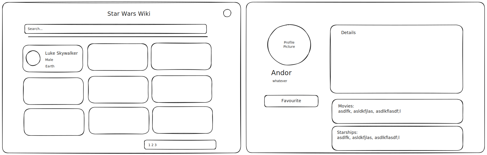

# Star Wars Wiki [(Preview)](https://jsuryahyd.github.io/star-wars-wiki)

### Requirements: [✔️]

- A wiki website with 3 Pages - Characters List Page,  Character Details Page, Favourites Page (Minimum Requirement)
- Scalable architecture. Clean, Readable and testable code. Attention to Details.(Minimum Requirement)
- React, Typescript and TDD (Minimum Requirement) 
- All pages should be Accessible. 
- Support light and dark themes. 
- CI/CD Setup 
- Deploy for Demo

### Architectural Choices

- An SPA built with React, which can be deployed as a static site.[✔️]
	- A Server Rendered site would also makes sense for SEO and faster initial page loads, as we can cache pages with common content.[✖️]
- **Monorepo [✖️]**: A monorepo would make sense if the project is part of a suite of applications and / or a ui component library is needed across the applications
- **Micro frontends [✖️]**: As the project size increases with large number of screens and multiple teams working on them, a micro frontend architecture would be recommended.
- Code splitting and Lazy loading (while not necessary in this case) can be implemented as bundle sizes grow, for faster page load times. [✖️]
- Deploy to Github Pages using Github Actions [✔️]

### Technology choices: [✔️]

- Node v20 is required for some of the dependancies(Chakra UI v3). It is a stable version.
- React with Typescript for a SPA (setup with **vite** build tool)
- Tanstack router for browser routing
	- Considered a better alternative for React-router, I wanted to try it out.
- Chakra UI for components and styling.
	- **Reason:** Part of the Allica Bank's tech stack. Ready to use components like Card, Grid etc would help in faster development time compared to Ark UI. In a real project, with enough time and resources, we would lean towards more performant options like ArkUI or Shadcn.
		- Out of the box support for responsive web design
		- Reusable components can be built as wrappers over Chakra UI components, to avoid vendor locking. 
		- Layout related components(Flex, Grid, Box etc) are directly used for now. 
- Tanstack Query for data fetching and caching 
	- Caching becomes much more critical in the application, as swapi.dev apis required calling of lot of subsequent apis, and server response times are slow.
- Context API for global state management 
	- Not much of state to manage in the frontend. So, Dedicated state management solutions are not required. React Query takes care of caching api responses.
- MSW, IndexedDB for caching favourites list 
	- MSW in browser can intercept crud operations on `/favourites` resource. Data can be persisted to indexedDB, as service workers do not have acccess to localstorage.
- Vitest and testing library for component and integration tests 
	- vitest is faster than jest and integrates well with vite.
	- testing-library is the go to, and a better choice compard to enzyme, for its DX and user-simulating API

### Others
- Tools like Sentry can be used for monitoring and observability.[✖️]
- Security
	- Proper CSP policies must be enforced.[✔️]
	- TLS must be used while deploying.[✔️]
	- User accounts and Login can be implemented for personalized features like favourites. (Not implemented currently[✖️])
	- NPM dependencies must be audited with npm audit and owasp top 10 vuln. must be checked[✖️]

## Development

*Wireframes*
### Layout Component:[✔️]
- A responsive layout that has a header and main page, and a footer.
- Header has Application title that links to home page
- Favourites button that links to Favourites page
- Light and Dark mode toggle button
### Characters List Page:[✔️]
- Should show a list of cards with **pagination**. Clicking on Cards should navigate to character details page. Should have a hover animation/indication that the card is clickable.
- Should implement a search input that filters by name from the server, with debouncing. Should sync the search input value with url query param.
- Pagination should also be in sync with url param
- Character Card component - with tests.
- Fetch and cache list with tanstack query. The api schema requires nested api calls. The merging logic should be consolidated in to custom hooks.
### Character Page:[✔️]
- should show details section, movies and starships sections.
- show a prominent "Add to Favourites/Remove favourite" button
- the current characterId will be fetched from the url

### Favourites Page:[✔️]
- Can be similar to characters list page, with local search and without pagination 

## Observations and Challenges
### Testing 
- Tanstack Router: The Documentation does not provide any info on testing. Setup is not straight farword. Took considerable time figuring out.
- Chakra UI components: Snapshot tests keeps failing as the generated ids keep changing. Need to find a work around.
- Need lots of test cases overall, with in the time constraint.
### API integration
- The swapi.dev(swapi.tech) response format is not optimal and inconsistent (also, does not return response as per specified schema), causing complexity in both development and testing.
- Alternatively, [swapi.info](https://swapi.info/) has simpler and uniform structure. Found it after the full implementation. so, still using swapi.dev
### CI/CD pipelines
- Troubleshooting typescript, eslint configs, and test failures.

## TODOs
- Improve quality of tests, by breaking scenarios in to multiple tests, with different msw response mocks in each test (`server.use()`)
- ~~Find workaround for flaky snapshot tests.~~
- Find solution for flaky tests that use `server.use()`: server.use() precedes over default handler when test runs in isolation, but not in group.
- ~~Fix CI/CD pipeline~~
- Generate Coverage Report (also as part of ci/cd pipeline)
- ~~Add Toast messages when a put/post api call is succeeded. (adding/removing favourites)~~
- ~~Implement "Undo" on put/post api calls. (within the toast, or within the card UI)~~
- Replace Swapi.dev with Swapi.info for cleaner api structure
- Important: add error response handling in the code, and test cases.
 

## Deployment Steps
- Being Deployed to github pages at https://jsuryahyd.github.io/star-wars-wiki
- CI/CD pipeline added at ./github/workflows/ci.yaml
- Alternatively, we can set deployment option to 'branch' and run `npm run deploy` comand in local system in the branch (currently the branch is `github-pages-deployment`)

## Local Development
- Clone the repo
- Install node version 20+
- npm install
- npm run dev
